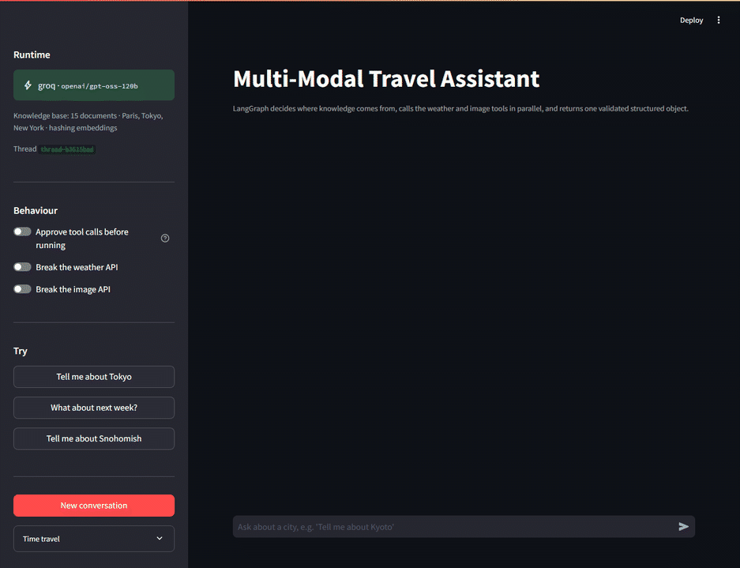
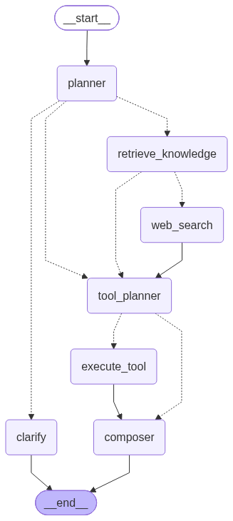

# Multi-Modal Travel Assistant

Ask about a city and get back a written summary, a 7-day forecast chart and a photo
gallery. A LangGraph agent decides where the knowledge should come from, fetches weather
and images concurrently, and returns a single validated object that Streamlit renders.



The badge under each answer says where it came from. Tokyo is answered from the local
vector store; the follow-up "What about next week?" keeps the city and the summary but
re-runs only the weather tool, so it is marked as coming from memory; Kyoto is not in the
corpus, so it routes to search.

## Running it

```bash
pip install -r requirements.txt
```

```bash
cp .env.example .env
```

Set a provider key in `.env`:

```bash
LLM_PROVIDER=groq
GROQ_API_KEY=your_key_here
```

```bash
streamlit run app.py
```

It also runs with no key at all. Without credentials it falls back to a deterministic
local stub, and everything except the quality of the prose behaves the same. That is
what keeps the tests offline.

```bash
python scripts/smoke.py      # four scenarios end to end, with assertions
python -m pytest tests -q    # test suite
python scripts/export_graph.py   # regenerate graph.png
python scripts/record_demo.py    # re-record assets/demo.gif (app must be running)
```

## How it works



### State

`AgentState` in `src/travel_agent/state.py` is a typed `TypedDict`. The reducer choices
matter more than they look: any key written by two nodes running in the same superstep
needs one, or LangGraph raises `InvalidUpdateError`. The parallel branch writes
`messages` (via `add_messages`), `tool_results`, `traces` and `warnings` (via
`operator.add`). Everything else has a single writer.

Per-turn results are tagged with a turn number rather than cleared between turns, so the
accumulating channels never need resetting and the trace view keeps a full history.

### Nodes

| Node | Does |
|---|---|
| `planner` | Resolves the city and decides what this turn needs |
| `retrieve_knowledge` | Queries Chroma, records why it hit or missed |
| `web_search` | Research path for cities outside the corpus |
| `tool_planner` | Gets tool calls from the model |
| `execute_tool` | Runs one tool call; N of these run at once |
| `composer` | Assembles and validates the report |
| `clarify` | Dead end when no city could be resolved |

### Routing

The store holds 15 documents covering Paris, Tokyo and New York, split into topical
chunks (overview, attractions, food, transport, when to go) rather than one blob per
city, so a query about food doesn't drag in the transport paragraph.

Two signals decide the route. The city metadata filter is authoritative: if documents
are tagged with that city, the store answers. Cosine similarity against
`SIMILARITY_FLOOR` is the fallback for fuzzy or misspelled input. Miss both and the graph
takes the web-search edge, which is what Kyoto or Snohomish will do.

The reason for the decision is written into state, so the UI can show why a given route
was taken instead of leaving you to guess.

### Structured output

The composer emits a Pydantic `TravelReport`: `city_summary`, `weather_forecast`
(a list of `WeatherPoint`), `image_urls`, plus highlights, sources and warnings. The UI
reads fields off that object; it never parses markdown.

The model only writes prose. Numbers and URLs are copied into the report from the actual
tool results, which means a hallucinated temperature can't reach the chart and an invented
URL can't reach the gallery. It also keeps the JSON step small enough that a mid-size
model gets it right consistently. Writing three text fields is a far easier ask than
transcribing an array of floats without drift.

### Tool calling

Tool schemas go to the provider as plain JSON. The response payload is kept as-is, and
`execute_tool` does the work by hand: look the tool up in the registry, coerce the
arguments against its schema, run it, and append a `ToolMessage` with the original
`tool_call_id`.

Argument coercion earns its place. Models send `"5"` where the schema says integer, add
keys that don't exist and drop optional ones, so the raw payload can't go straight into a
Python call.

Errors return as error `ToolMessage`s instead of propagating. Break the weather API from
the sidebar toggle and the gallery still renders, the report carries a warning, and the
chart area explains itself rather than showing an empty axis.

### Parallelism

`dispatch_tools` returns one `Send` per tool call, so LangGraph runs that many copies of
`execute_tool` in a single superstep. The tools are async and await real I/O, so they
overlap.

Every node records start and end times, and the UI draws them on a shared timeline where
the overlap is visible. On a typical turn the two tools sum to about 1.9 s of work and
finish in under 1 s. `test_tools_run_in_parallel` fails if that ratio drops below 1.4x or
if the second execution starts after the first has finished.

### Memory

A `MemorySaver` keyed by `thread_id` holds conversation state. The case worth trying:

| Turn | City | Tools called | Summary |
|---|---|---|---|
| "Tell me about Tokyo" | Tokyo, from the vector store | weather + images | generated |
| "What about next week?" | Tokyo, from the checkpoint | weather only, offset 7 days | reused |

On the second turn the planner sets `needs_summary=False`, routing skips retrieval
entirely, and the composer takes the prose out of state. Cached artefacts are gated on
the city still matching, so a new destination never inherits the previous one's forecast.

Turning on *Approve tool calls before running* compiles the graph with
`interrupt_before=["execute_tool"]`. It then pauses with the proposed calls on screen;
approving resumes with `ainvoke(None, config)`, rejecting clears the proposals through
`update_state(as_node="tool_planner")` so dispatch falls through to the composer.

The sidebar also lists checkpoints from `get_state_history()` with the state captured at
each superstep.

## Design notes

**Provider choice.** The task named OpenAI or Anthropic; this runs on Groq's free tier.
The provider layer is genuinely swappable. `LLM_PROVIDER=groq|openai|anthropic` picks
the client with no code change, `openai_compat.py` covers Groq and OpenAI since they
share a wire format, and `anthropic_client.py` implements the Messages API including
`tool_use` and `tool_result` round-tripping. The Groq default is `openai/gpt-oss-120b`.

**Mock data.** Mocks are the default and simulate latency (`MOCK_LATENCY`), which also
gives the parallel step something real to overlap. The weather mock is deterministic per
city and date, so results are reproducible, but varies by per-city climate anchors and a
seasonal sine wave rather than being uniform noise, so Cairo runs hotter than Reykjavik
and the southern hemisphere is inverted. Image URLs are curated Unsplash IDs; cities without
a curated set get placeholders that are labelled as generic stock rather than passed off
as the destination.

`USE_LIVE_APIS=true` switches to Open-Meteo for weather and the Wikipedia REST API for
images, both keyless. Live search needs `TAVILY_API_KEY`. Each live path falls back to
its mock on failure and records why.

**Embeddings.** The default is a hashing embedder: signed hashing over words, bigrams
and character trigrams, L2-normalised. At this corpus size lexical overlap is enough, and
the router leans on city metadata anyway. MiniLM is available via
`EMBEDDING_BACKEND=minilm`, but torch's cold import costs about two minutes here, which is
too much to put in front of a Streamlit start. Collections are namespaced per backend so
the two never share an index.

**TLS.** `bootstrap.py` calls `truststore.inject_into_ssl()` before anything makes a
request. On machines where an AV or corporate proxy re-signs HTTPS, the root CA is in the
Windows certificate store but not in `certifi`, and every call otherwise fails with
`CERTIFICATE_VERIFY_FAILED`.

## Layout

```
app.py                      Streamlit entry point, view logic only
graph.png                   Graph topology
scripts/smoke.py            Four end-to-end scenarios
scripts/export_graph.py     Regenerates graph.png
scripts/record_demo.py      Regenerates the demo GIF
src/travel_agent/
  bootstrap.py              TLS and offline-model setup
  config.py                 Settings and provider resolution
  schemas.py                TravelReport, WeatherPoint, TurnPlan
  state.py                  AgentState and reducers
  llm/                      Base contract, groq/openai, anthropic, offline, factory
  knowledge/                Seed corpus, embeddings, Chroma store
  tools/                    Registry, argument validation, weather, images, search
  graph/                    Builder, prompts, tracing
    nodes/                  planner, knowledge, tool_planner, executor, composer
  ui/render.py              Charts, gallery, trace view
tests/
```

## Tests

`pytest tests -q` covers routing in both directions, argument coercion, the
`tool_call` to `ToolMessage` round trip, measured parallel overlap, follow-ups calling
only the weather tool, degradation when a tool fails, and checkpoint history being
addressable for replay.
